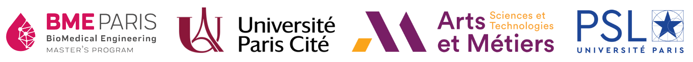

# Nervobot
 
 **Version 1.0.0**

A Bio-inspired robot with an actual nervous system. In this ongoing project at BME Paris, we are mimicking a living nervous system, using Neurino electronics. More info on the project can be found [here](https://wiki.bme-paris.com/2023-project07/tiki-index.php?page=HomePage).

**Project team**: Polina Kostina, Sirikorn Chalanunt, Dimitar Tahov

**Project supervisor**: Prof.-Dr. Samuel Bottani
 
**Project location**: Université Paris Cité, Biomedical Engineering Division (BME).

<! ---  --->

